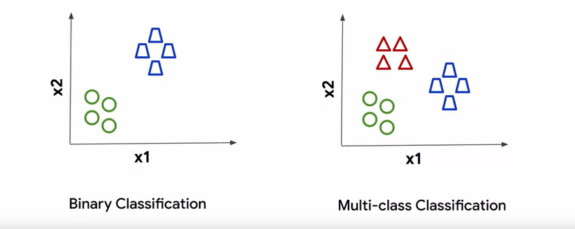

# advanced-computer-vision-with-tensorflow
Computer vision advenced tensorflow program

## Image Classification 

* Multi-class Classification
  * Binary Classification (Subset of problem)
* Multi-label Classification

## Recap
 * Multi-class classification
  
 * Mult-label classification
  

## Binary vs. Multi class classification

