# advanced-computer-vision-with-tensorflow
Computer vision advenced tensorflow program

## Image Classification 

* Multi-class Classification
  * Binary Classification (Subset of problem)
* Multi-label Classification

## Recap
 * Multi-class classification
  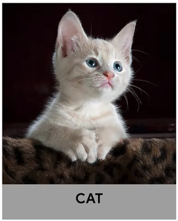
 * Mult-label classification
  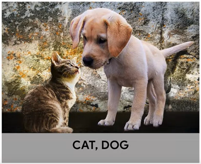

## Binary vs. Multi class classification

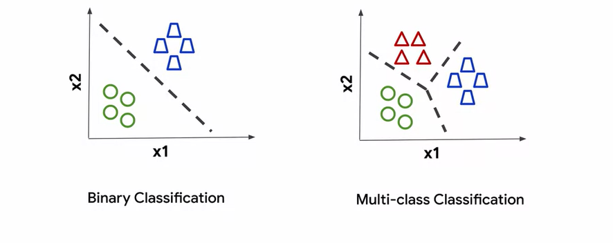

## Object Localisation

Identifying where is object in image is calling **Object Localisation**

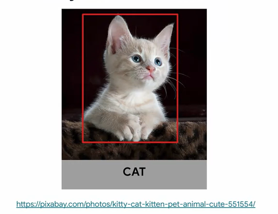

## Object Detection
Combined Object detection and multi-label classification is calling **Object detection**

## Object Detection

* For each object
  * confidence score
  * bounding boxes
* Popular algorithms
  * R-CNN
  * Faster-RCNN
  * YOLO
  * SSD

## Image segmentation

In digital image processing and computer vision, [image segmentation](https://en.wikipedia.org/wiki/Image_segmentation) is the process of partitioning a digital image into multiple image segments, also known as image regions or image objects (sets of pixels).

There are two types of segmentation: 
* **Semantic Segmentation**: All objects are sames types from the single classification.
* **Instance Segmentations**:Instance Segmentation is the technique of detecting, segmenting, and classifying every individual object in an image. 

## Semantic vs. Instance Segmentation

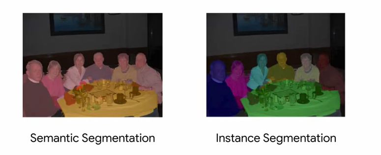

## Semantic Segmentation
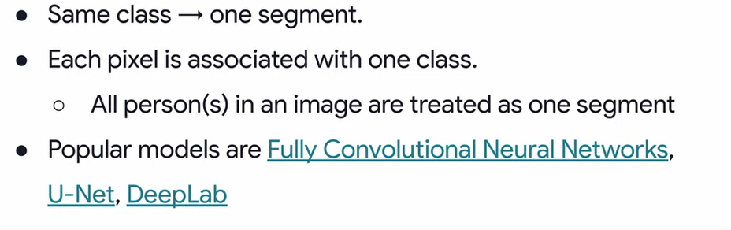

## Instance Segmentation

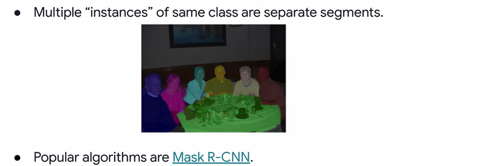

## Useful Link

1. [https://www.coursera.org/professional-certificates/tensorflow-in-practice](https://www.coursera.org/professional-certificates/tensorflow-in-practice)
2. [U-Net](https://lmb.informatik.uni-freiburg.de/people/ronneber/u-net/)
3. [DeepLab](http://liangchiehchen.com/projects/DeepLab.html)
4. [Mask R-CNN](https://arxiv.org/abs/1703.06870)

## Convolutional Neural Networks Architecture

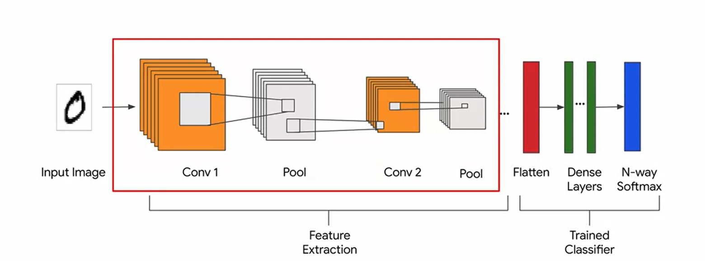

## What is Transfer Learning ?

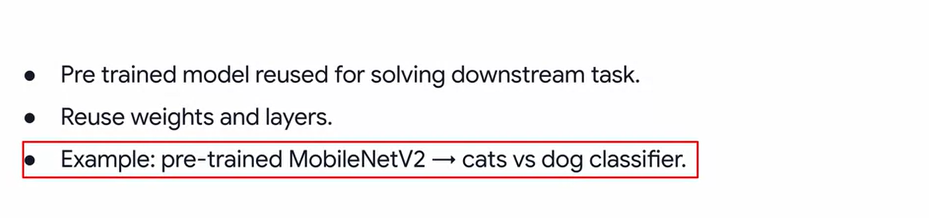

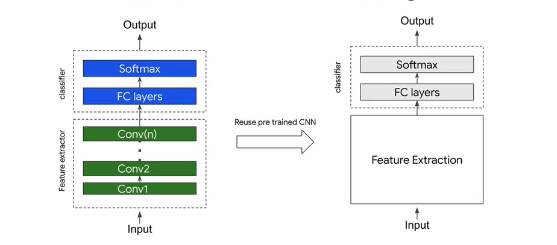

## Freeze the weights

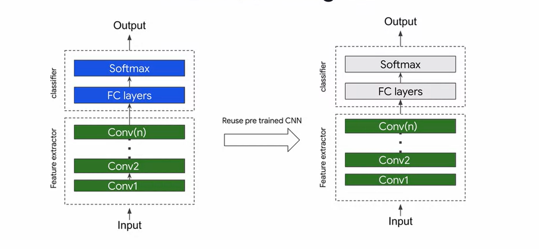

## Train with learned values as default

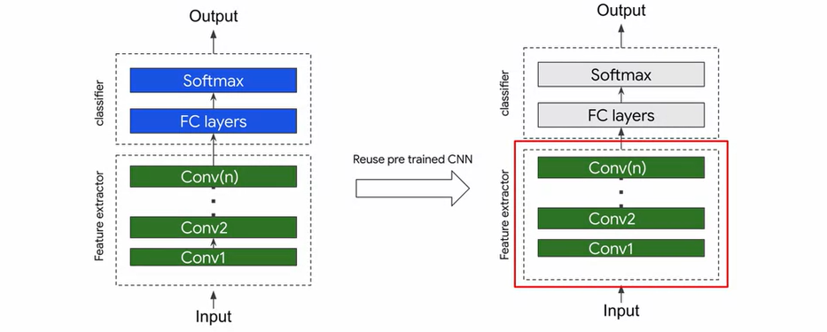

## dataset

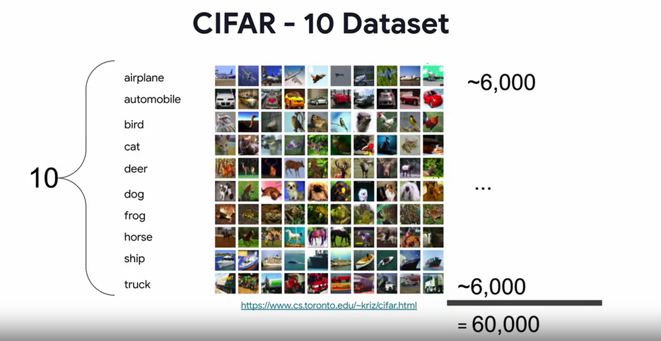

## ResNet 50

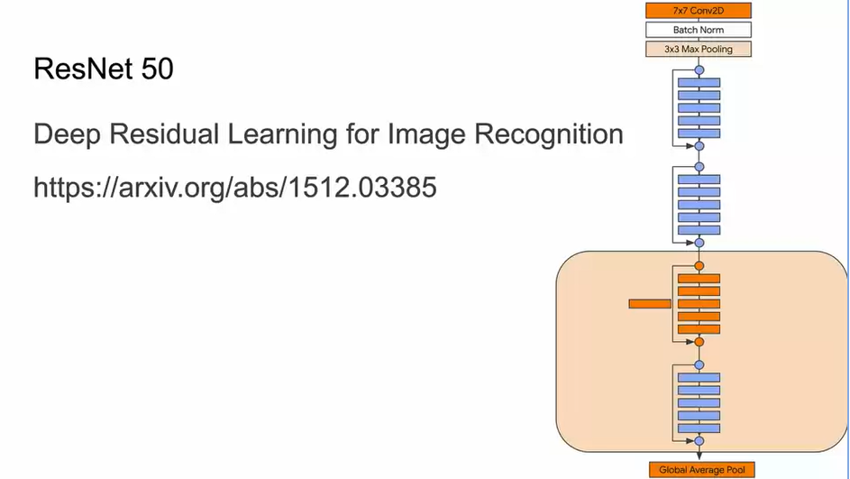